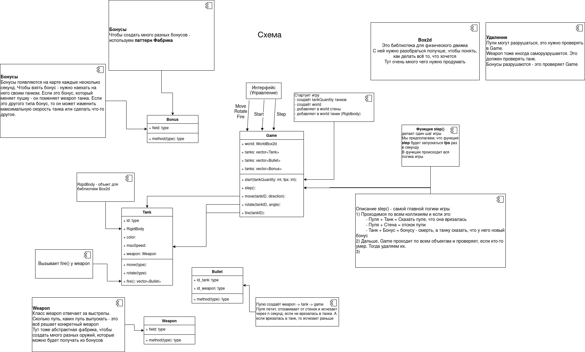

# mipt_hw_tp_project

- Игра танчики. Играют несколько игроков с одного компьютера. Танки управляются, например WASD и стрелками. (Но это, кажется интерфейс)
- Карта - лабиринт. Можно ездить по нему. Сквозь стенки нельзя проезжать.
- Можно стрелять пулями. Пули исчезают при столкновении с танком, рикошетят от стен. И через 15 секунд исчезают, если не нашли танка.
- Бонусы появляются на карте и их можно поднимать и тогда твоё оружие сменится на то, что в бонусе. Или если бонус - это скорость, то изменится скорость.
- Список бонусов:
  - Дробь (много мелких пуль) Несколько зарядов
  - Скорость
  - Пуля замедленного действия. (стреляешь пулей. Когда стреляешь второй раз - та пуля, которая в полёте взрывается во все стороны)

- Через интерфейс можно сделать так, чтобы игра длилась несколько раундов. 

Какая-то схема происходящего

