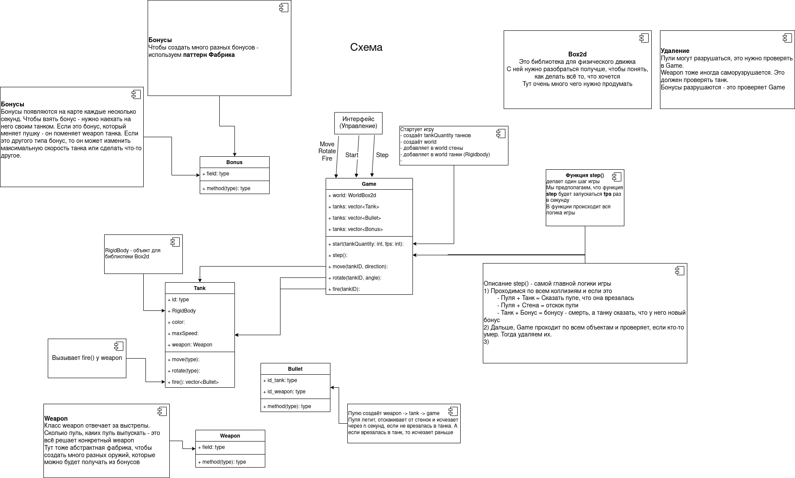

## English

Prerequisites:
- The game uses graphics library SFML, to install the library run
  + On Linux:
    ```
    sudo apt-get install libsfml-dev
    ```
  + On Mac:
    ```
    brew install sfml
    ```

To run the game, execute `run.sh` script.

To install the game, execute `install.sh` script with one argument: destination folder.

Game controls:
- First player: Arrows and `Space` for shooting.
- Second player: `WASD` and `Q` for shooting.
- Third player: `TFGH` and `R` for shooting.
- Fourth player: `IJKL` and `U` for shooting.

## Запуск проекта

Проект использует две нестандартные библиотеки: Box2d, SFML  
- Box2d - лежит в папке проекта и подгружается через cmake  
- SFML - нужно установить  
  + На linux, это делается командой  

        sudo apt-get install libsfml-dev

Чтобы скомпилировать и запустить проект, нужно выполнить скрипт `run.sh`

Чтобы установить проект, нужно выполнить скрипт `install.sh` с единственным аргументом - папкой, куда устанавливать

## Распределение обязанностей

Максим делает игру (логику)

Антон делает графику

В ветках dev_game_logic и dev_game_graphics

## mipt_hw_tp_project

- Игра танчики. Играют несколько игроков с одного компьютера. Танки управляются, например WASD и стрелками. (Но это, кажется интерфейс)
- Карта - лабиринт. Можно ездить по нему. Сквозь стенки нельзя проезжать.
- Можно стрелять пулями. Пули исчезают при столкновении с танком, рикошетят от стен. И через 15 секунд исчезают, если не нашли танка.
- Бонусы появляются на карте и их можно поднимать и тогда твоё оружие сменится на то, что в бонусе. Или если бонус - это скорость, то изменится скорость.
- Список бонусов:
  - Дробь (много мелких пуль) Несколько зарядов
  - Скорость
  - Пуля замедленного действия. (стреляешь пулей. Когда стреляешь второй раз - та пуля, которая в полёте взрывается во все стороны)


- Через интерфейс можно сделать так, чтобы игра длилась несколько раундов. 

Какая-то схема происходящего


